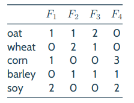

307multigrains
===

Time:       4 weeks

Team:       1

Language:   Python


The project
----
Jean-Eude grows grains: oat, wheat, corn, barley and soy. He uses four different types of fertilizers (F1, F2, F3 and F4), in the following quantities (per ton of fertilizer in order to produce one unit of grains):



Keeping in mind that he has limited yearly quantities of each type of fertilizer, he would like to optimize his output according to the grains’ prices. You’re going to develop a program that will take his fertilizer resources and the prices of each type of grain as parameter. It will display the quantities to produce, as well as the total value of his output.


## USAGE:

```
>> ./307multigrains -h
USAGE
    ./307multigrains n1 n2 n3 n4 po pw pc pb ps

DESCRIPTION
    n1  number of tons of fertilizer F1
    n2  number of tons of fertilizer F2
    n3  number of tons of fertilizer F3
    n4  number of tons of fertilizer F4
    po  price of one unit of oat
    pw  price of one unit of wheat
    pc  price of one unit of corn
    pb  price of one unit of barley
    ps  price of one unit of soy
```

Author [**Corentin COUTRET-ROZET**](https://github.com/sheiiva)